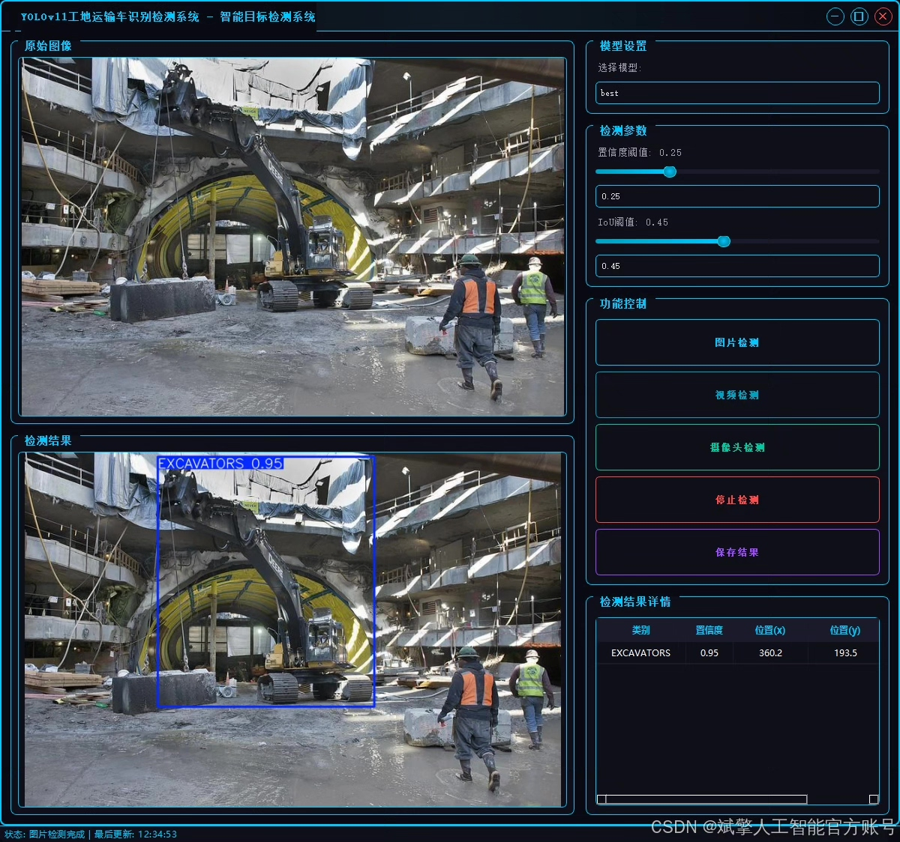
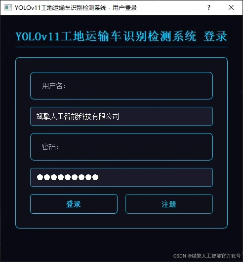
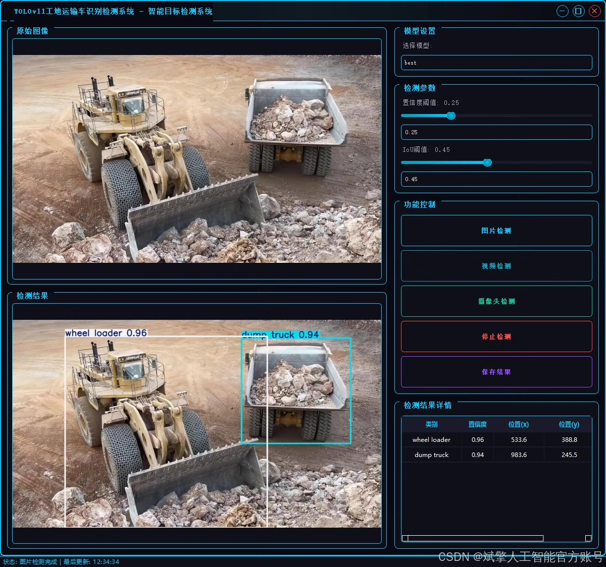
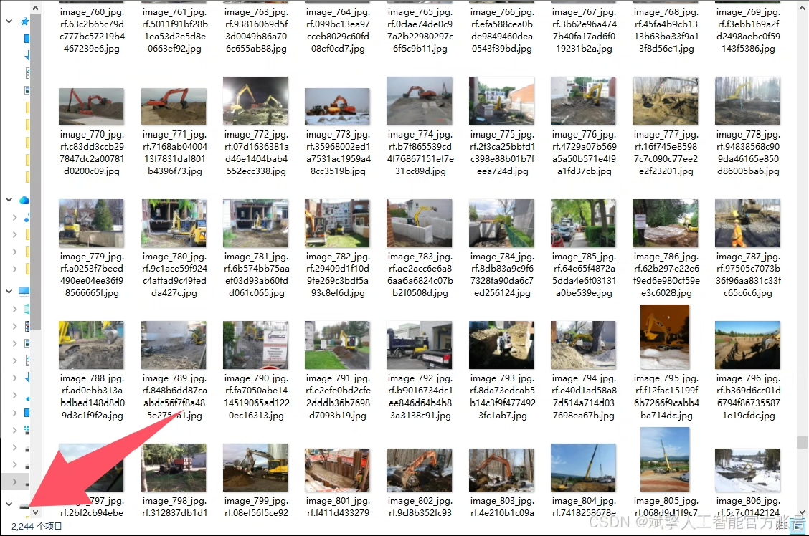
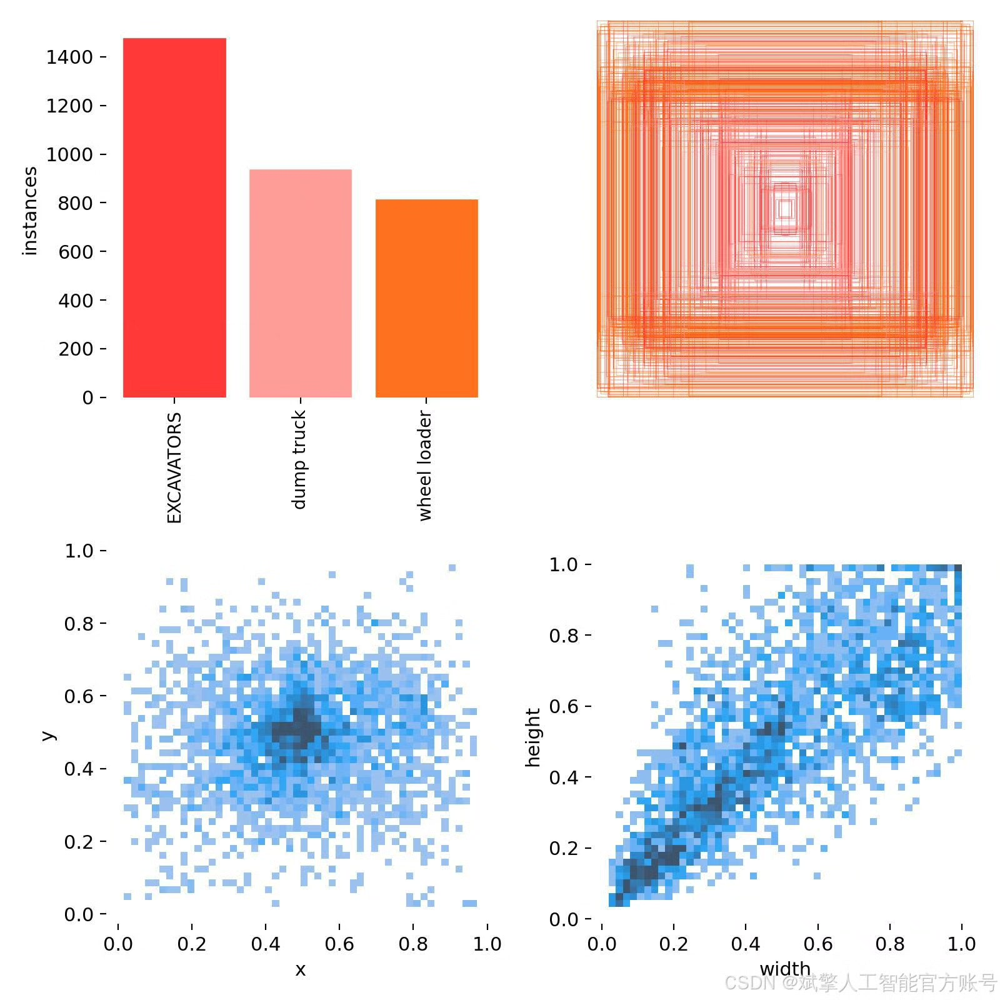
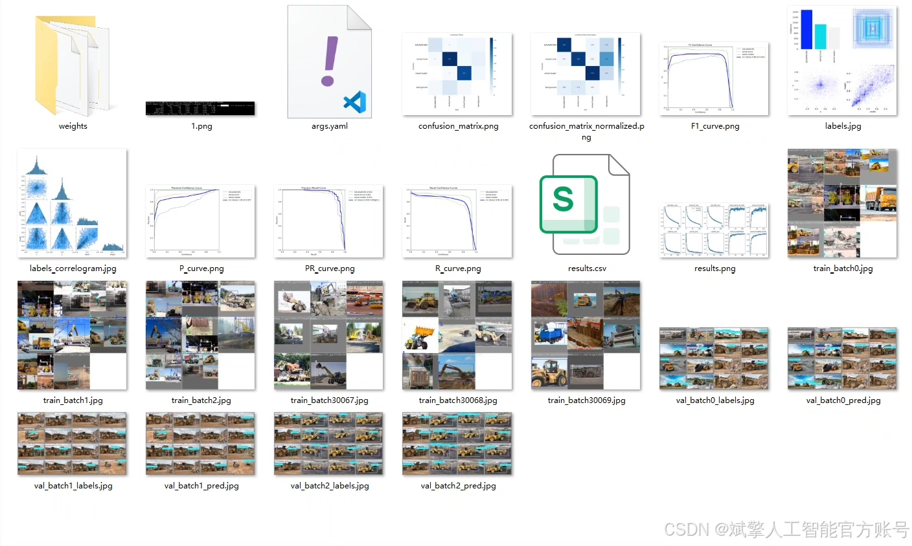
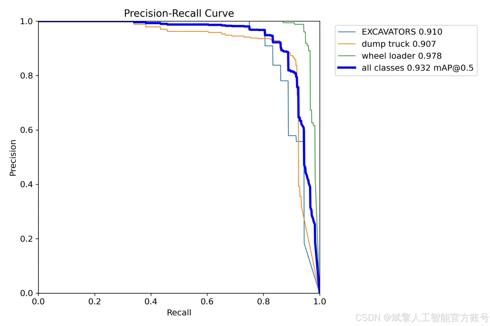
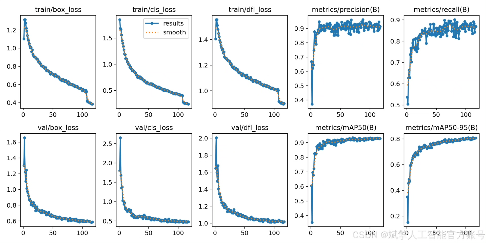
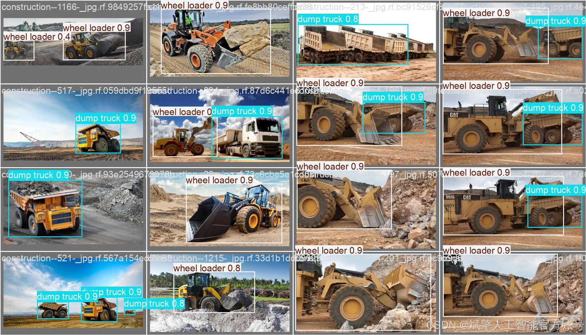

# YOLOv11 construction site vehicle recognition system

## Body

YOLOv11 Construction Site Transport Vehicle Recognition System Based on Deep Learning YOLOv11: A Smart Detection System for Construction Site Transport Vehicles (YOLOv11+YOLO dataset + UI interface + login and registration interface + Python project source code + model)

This paper proposes a smart detection system for construction site transport vehicles based on deep learning YOLOv11, aiming to achieve high-precision real-time detection of common transport vehicles in construction sites (including excavators, dump trucks, and wheel loaders). The system employs an improved YOLOv11 algorithm, combined with the YOLO format dataset (comprising 2244 training images, 267 validation images, and 144 test images). Additionally, the system integrates a user-friendly UI interface that supports login and registration functions. Experimental results show that the system achieved a high detection accuracy (mAP@0.5 is 93.2%) on the test set, effectively meeting the needs of intelligent management of construction site vehicles. This paper details the system architecture, algorithm implementation, and interaction design, providing complete Python project source code and pre-trained models, offering a reproducible solution for related research and applications.

✅ User Login and Registration: Supports password verification and security validation.
✅ Three Detection Modes: Based on the YOLOv11 model, supporting image, video, and real-time camera detection, accurately recognizing targets.
✅ Dual-Screen Comparison: Display original images and detection results on the same screen.
✅ Data Visualization: Real-time table displaying the category, confidence, and coordinates of detected targets.
✅ Intelligent Parameter Tuning: Offers a confidence slide bar to dynamically optimize detection accuracy, adapting to different scene requirements.
✅ Sci-Fi Style Interactive Interface: Dark theme paired with dynamic light effects, reducing visual fatigue and enhancing operational experience.

## Images

## Payment

Here is a pay link on Stripe ( https://buy.stripe.com/3cs8yP7sY87d0vu9AB ). Please contact me lonlonago@foxmail.com after funding $89, and I will send you a complete data files , thank you!

